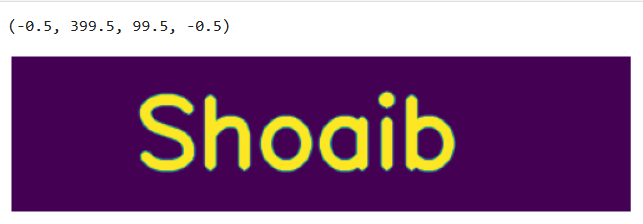
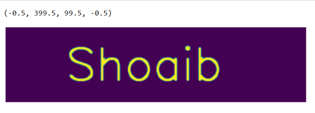

# Implementation-of-Erosion-and-Dilation
## Aim
To implement Erosion and Dilation using Python and OpenCV.
## Software Required
1. Anaconda - Python 3.7
2. OpenCV
## Algorithm:
### Step1:
Import the necessary pacakages

### Step2:
Create the text using cv2.putText

### Step3:
Create the structuring element

### Step4:
Erode the image

### Step5:
Dilate the Image

 
## Program:
```
# Import the necessary packages
import cv2
import numpy as np
from matplotlib import pyplot as plt

# Create the Text using cv2.putText
img = np.zeros((100,400),dtype = 'uint8')
font = cv2.FONT_HERSHEY_SIMPLEX
cv2.putText(img ,'Shoaib',(80,70),font,2,(255),5,cv2.LINE_AA)
plt.imshow(img)
plt.axis('off')

# Create the structuring element
kernel = np.ones((5,5),np.uint8)
kernel1 = cv2.getStructuringElement(cv2.MORPH_CROSS,(5,5))
cv2.erode(img,kernel)

# Erode the image
img_erode = cv2.erode(img,kernel1)
plt.imshow(img_erode)
plt.axis('off')

# Dilate the image
img_dilate = cv2.dilate(img,kernel1)
plt.imshow(img_dilate)
plt.axis('off')
```
## Output:

### Display the input Image


### Display the Eroded Image


### Display the Dilated Image


## Result
Thus the generated text image is successfully eroded and dilated using python and OpenCV.
